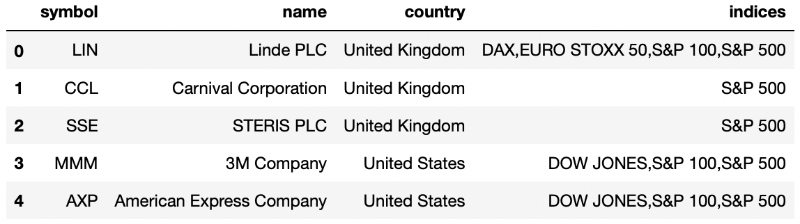
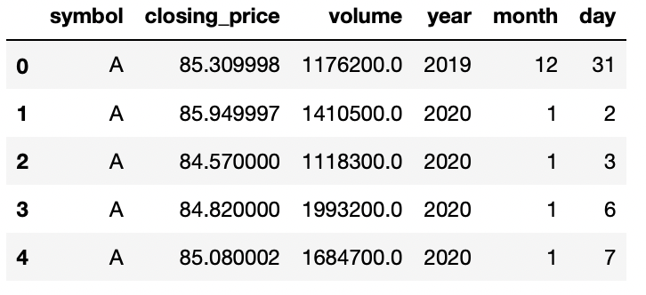
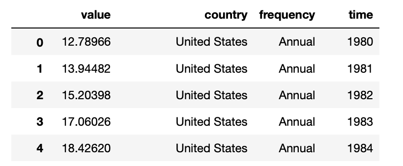
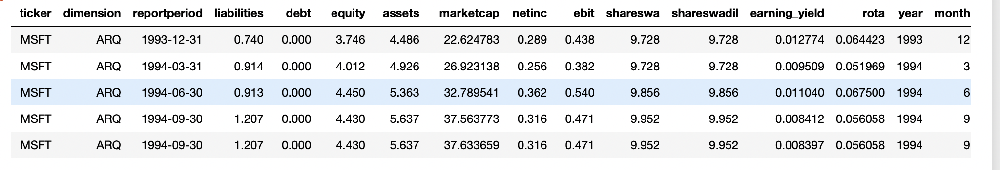

# Finance Data Project

# 1. Goal of the Project

### 1.1. Goal of the Project
Inflation is currently a huge issue in Europe and the USA. 
The project aims to gather data that allows to analyze the correlation between 
money printing of the central banks and stocks or asset prices to identify suitable investments to
protect once purchasing power over time. The data might also allow to identify investment opportunities.

### 1.2. Which kind of queries will be run?
The goal is to create data tables for stock prices, financial data of companies and money supply (money printing).
The tables will be joined on time and company name columns. 
For certain analysis the stock prices table will be grouped by time and the stock valuations will be averaged over
all companies in a certain index such as the S&P500.

### 1.3. How is Airflow Incorporated Into the Project?
Airflow is used in the project to read the latest stock prices from the yahoo finance API. 
The DAG runs once every quarter because the project tries to answer macro economical questions and 
those findings do not change on a daily basis.

# 2. Choice of Technologies
The following tools and technologies are used in the project

- **AWS S3:** The stock prices data from the yahoo finance API is stored as csv-files in a AWS S3 bucket.
The S3 bucket is a scalable, low cost object storage that can handle large amounts of data. 
Moreover it is possible to insert data from S3 into redshift.
- **Redshift:** Redshift is a scalable data warehouse that allows to run sql queries.
- **Airflow:** Airflow is used as a scheduler to run the pipeline once every quarter to get the latest stock price data from the yahoo finance api 
and insert the new data into redfshift

# 2. Data Sources

### 2.1.  Ticker Symbols from pytickersymbols
The stock ticker symbols are downloaded with pytickersymbols package.
The pytickersymbols package provides access to google and yahoo ticker symbols for all stocks of the following indices.
The ticker symbols are downloaded with an airflow task once every quarter and are stored in the S3 Bucket as csv files.
Link: https://pypi.org/project/pytickersymbols/



### 2.2. Stock Price Data 
The pipeline download the stock prices from the yahoo finance API for every ticker that has been downloaded 
with the pytickersymbols package. The data contains closing prices and trading volumes.
The stock price data is downloaded with an airflow task once every quarter and are stored in the S3 Bucket as csv files.
Link: https://pypi.org/project/yfinance/



### 2.3. Money Supply Data
The Money supply data was downloaded from https://stats.oecd.org/. The data is stored as a csv-file in the S3 bucket.



### 2.4. Stock Fundamentals Data
The stock fundamentals data was downloaded from https://data.nasdaq.com. The data is stored as a csv-file in the S3 bucket.

The size of the dataset is 2.647.073 rows.
#


# 3. Data Model and Pipeline

# 4. Results

# 5. Scenarios

# 6. Airflow Project

## 6.1. Local installation for Airflow
- **Installation**: A tutorial for  installing airflow locally can be found here:
https://airflow-tutorial.readthedocs.io/en/latest/first-airflow.html

- **Start the webserver**: ```airflow webserver -p 8080```
- **Start the scheduler**: ```airflow scheduler```

## 6.2. Configure AWS

### 6.2.1. Configure AWS Permissions:
- **create a new user**: IAM -> create a user -> programmatic access -> store the credentials. These are needed to configure airflow later on.
- **S3 and redshift permission:**: Provide the user with s3 and redshift access permissions

### 6.2.2. Configure the Redshift Cluster:
Got to redshift and create a new cluster. You need additional configurations to be able to access the cluster from your local airflow installation:
- **Newtwork and security:** publicly accessible : enable
- **Access credentials**: Set a username and a password. These are needed to configure the airflow redshift connection in the next step

## 6.3. Configure Airflow:

### 6.3.1. Configure AWS Access Credentials
Admin -> connections -> aws_credentials -> enter the user credentials

### 6.3.1. Configure AWS redshift connection

Admin -> connections -> create:
- Conn Id: redshift
- Conn type: Postgres
- Host: Copy passte from aws postgres endpoint. Remove port and schema.
- Schema: dev
- login: username as configured for aws redshift
- Password: Passwort set for aws reshift

## 6.4. Other
-**Check for load errors in redshift:** ```"SELECT * FROM stl_load_errors;"```
