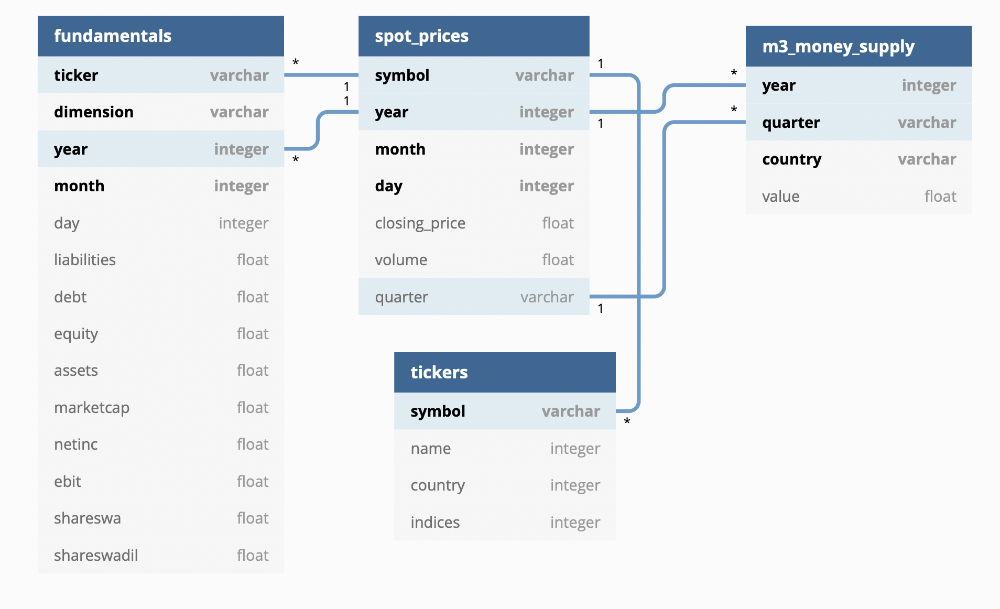
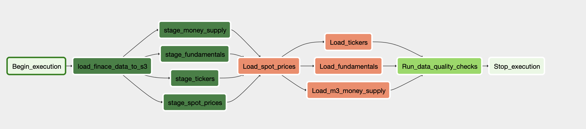
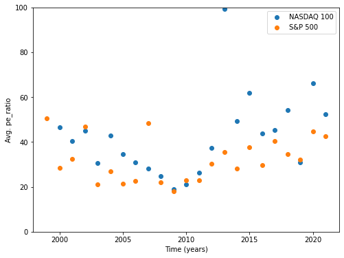
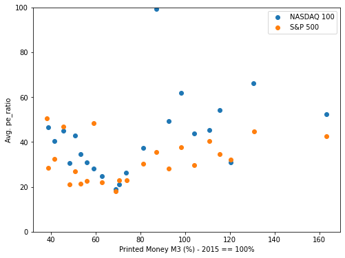
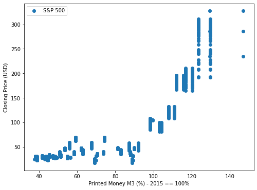

# Finance Data Project

# 1. Goal of the Project

### 1.1. Goal of the Project
Inflation is currently a huge issue in Europe and the USA. 
The project aims to gather data that allows to analyze the correlation between 
money printing of the central banks and stocks or asset prices to identify suitable investments to
protect once purchasing power over time. The data might also allow to identify investment opportunities.

### 1.2. Which Kind of Queries Will Be Run?
The goal is to create data tables for stock prices, financial data of companies and money supply (money printing).
The tables will be joined on time and company name columns. 
For certain analysis the stock prices table will be grouped by time and the stock valuations will be averaged over
all companies in a certain index such as the S&P500.

### 1.3. How is Airflow Incorporated Into the Project?
Airflow is used in the project to read the latest stock prices from the yahoo finance API. 
The DAG runs once every quarter because the project tries to answer macro economical questions and 
those findings do not change on a daily basis.

# 2. Choice of Technologies
The following tools and technologies are used in the project

- **AWS S3:** The stock prices data from the yahoo finance API is stored as csv-files in a AWS S3 bucket.
The S3 bucket is a scalable, low cost object storage that can handle large amounts of data. 
Moreover it is possible to insert data from S3 into redshift.
- **Redshift:** Redshift is a scalable data warehouse that allows to run sql queries.
- **Airflow:** Airflow is used as a scheduler to run the pipeline once every quarter to get the latest stock price data from the yahoo finance api 
and insert the new data into redfshift

# 2. Data Sources

### 2.1.  Ticker Symbols from pytickersymbols
The stock ticker symbols are downloaded with pytickersymbols package.
The pytickersymbols package provides access to google and yahoo ticker symbols for all stocks of the following indices.
The ticker symbols are downloaded with an airflow task once every quarter and are stored in the S3 Bucket as csv files.
Link: https://pypi.org/project/pytickersymbols/


### 2.2. Stock Price Data 
The pipeline download the stock prices from the yahoo finance API for every ticker that has been downloaded 
with the pytickersymbols package. The data contains closing prices and trading volumes.
The stock price data is downloaded with an airflow task once every quarter and are stored in the S3 Bucket as csv files.
Link: https://pypi.org/project/yfinance/


### 2.3. Money Supply Data
The Money supply data was downloaded from https://stats.oecd.org/. The data is stored as a csv-file in the S3 bucket.
The value column is in percent. A value of 100 corresponds to the money supply of the year 2015.


### 2.4. Stock Fundamentals Data
The stock fundamentals data was downloaded from https://data.nasdaq.com. The data is stored as a csv-file in the S3 bucket.
The size of the dataset is 2.647.073 rows.


# 3. Data Model and Pipeline

### 3.1. Data Model
The final data model is as shown in the diagram. The different financial data tables can be joined via year, 
quarter and stock ticker symbols.


### 3.2. spot_prices Table
The spot_prices table is the fact table of the data model. The **spot_prices** table has the following columns:
- **symbol**: varchar(256), the stock ticker symbol
- **year**: smallint, the year of the data point
- **month**: smallint, the month of the data point
- **day**: smallint, the day of the data point
- **quarter**: varchar(256), the quarter of the data point
- **closing_price**: float, stock market closing prices in USD
- **volume**: float, stock market trading volume in number of shares

The PRIMARY KEY is a composite key of the following columns: symbol, year, month, day

### 3.3. tickers Table
The **tickers** table has the following columns:
- **symbol**: varchar(256), the stock ticker symbol
- **name**: varchar(256), name of the stock or company
- **country**: varchar(256), the country of the headquarter
- **indices**: varchar(256), the stock market indices that contain the stock

The PRIMARY KEY is following columns: symbol

### 3.4. m3_money_supply Table
The **m3_money_supply** table has the following columns:
- **country**: varchar(256), the country of the central bank
- **year**: int, 
- **quarter**: varchar(256), e.g. Q1
- **value**: float, the m3 money supply in percent, 100% correspond to the money supply in the year 2015

The PRIMARY KEY is a composite key of the following columns: country, year, quarter

### 3.5. fundamentals Table
The **fundamentals** table has the following columns:
- **ticker**: varchar(256),  the stock ticker symbol
- **dimension**: varchar(256), the type of fundamentals report. e.g. annual or quarterly 
- **year**: int, 
- **month**: int,
- **day**: int,
- **liabilities**: float, in billion USD
- **debt**: float, in billion USD
- **equity**: float, in billion USD
- **assets**: float, in billion USD
- **marketcap**: float, in billion USD
- **netinc**: float, in billion USD
- **ebit**: float, in billion USD
- **shareswa**: float, number of shares in billions
- **shareswadil**: float, number of shares in billions

The PRIMARY KEY is a composite key of the following columns: ticker, dimension, year, month

### 3.6. Data Pipeline
The api data is stored in the S3 bucket first. The data is then copied into staging tables. 
Finally the data is inserted into the target tables. 


# 4. Results

The financial data shows a strong correlation between stock price and central bank money supply. 
However, the correlation between the price to earnings ratio and the money supply is weak.

## 4.1 Price to Earnings Ratio over Time


## 4.2 Price to Earnings Ratio vs Money Supply


## 4.2 S&P 500 Price vs Money Supply


# 5. Scenarios
- **The data was increased by 100x:** The chosen technologies are capable to deal with such large amounts of data. 
It might be helpfgul to run the DAG in this scenario more frequently e.g. every week and not every 3 months.
- **The pipelines would be run on a daily basis by 7 am every day:** The pipeline can be run every day. The only necessary adjust is to change the schedule interval.
- **The database needed to be accessed by 100+ people:** Redshift can be used by such amounts of people. The number of nodes needs to be adjusted.

# 6. Airflow Project

## 6.1. Porject Structure
- **plugins/helpers/sql_queries.py**: Contains the SQL statements for inserting values into the staging, fact and dimension tables
- **plugins/helpers/data_quality.py**: Cotains the definition of the data quality checks to be performed
- **operators**: Python code for the different custom operators such as staging the data, filling the data warehouse, and running checks on the data as the final step
- **create_tables.sql**: SQL statements to create the tables on AWS redshift

## 6.2. Local installation for Airflow 
A tutorial for  installing airflow locally can be found here:
https://airflow-tutorial.readthedocs.io/en/latest/first-airflow.html

If you want to change your airflow home_dir: export AIRFLOW_HOME=<my_local_airflow_directory>

If you are using apache airflow version 2.2.4, then airflow can be started in the terminal via: ```airflow standalone```

This project uses python 3.8.8

Airflow can be installed with pip:
- ```pip install --upgrade pip==20.2.4```
- ```pip install apache-airflow==2.2.4```

## 6.3. Configure AWS

### 6.3.1. Configure AWS Permissions:
- **create a new user**: IAM -> create a user -> programmatic access -> store the credentials. These are needed to configure airflow later on.
- **S3 and redshift permission:**: Provide the user with s3 and redshift access permissions

### 6.3.2. Configure the Redshift Cluster:
Go to redshift and create a new cluster. You need additional configurations to be able to access the cluster from your local airflow installation:
- **Newtwork and security:** publicly accessible : enable
- **Access credentials**: Set a username and a password. These are needed to configure the airflow redshift connection in the next step

## 6.4. Configure Airflow:

### 6.4.1. Configure AWS Access Credentials
In the airflow UI navigate to Admin -> connections -> aws_credentials -> and enter the credentials of the aws user.

### 6.4.1. Configure AWS redshift connection
In the airflow UI navigate to Admin -> connections -> create and enter following details:
- Conn Id: ```redshift```
- Conn type: Postgres
- Host: Copy passte from aws postgres endpoint. Remove port and schema.
- Schema: ```dev```
- login: username as configured for aws redshift
- Password: Passwort set for aws reshift

